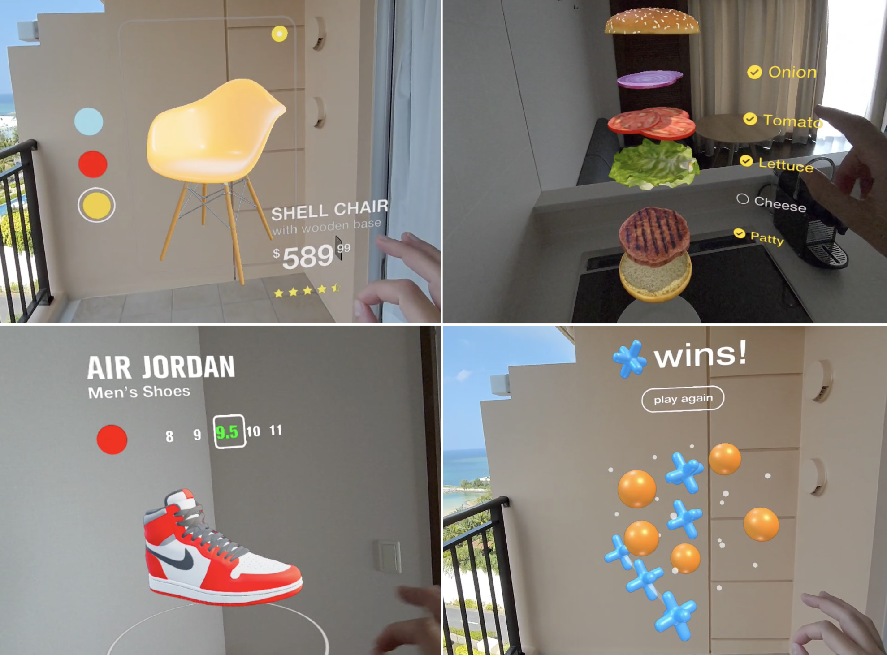

# webxr-demos

A collection of WebXR demos optimized for Spectacles.




### Installation

Clone the repository and install dependencies:

```bash
git clone https://github.com/soon/webxr-demos.git
cd webxr-demos
npm install
```

Run a local development server from a demo folder, for example:

```bash
cd demos/glowcube
npm run dev
```

Open the local URL in a **WebXR-enabled browser** (Spectacles Browser or other headset with WebXR support) to try the demo.


### Glow Cube

**Live demo:** https://webxr-glowcube.vercel.app/

Demo exploring real-time hand interaction and simple procedural effects in WebXR. By pinching with both hands, the user can spawn and scale a glowing cube with a GLSL shader, while a basic physics system (Cannon.js) handles motion and collisions.

The GLSL shader is based on [kishimisu’s video](https://www.youtube.com/watch?v=f4s1h2YETNY).


### Chair

**Live demo:** https://webxr-chair.vercel.app/

Demo where the user can explore a 3D chair model through hand gestures. By pressing buttons to change colors, and pinching and pulling the top-right switch, the model opens into space at 1:1 scale, allowing the user to inspect its dimensions and details.

**Code structure:**

- `main.js` — Initializes WebXR, scene, and render loop.
- `XRSetup.js` — Sets up Three.js renderer, camera, and XR session.
- `HandInput.js` — Tracks hand joints and pinch gestures for rotation and input.
- `ChairExperience.js` — Core logic for models, materials, animations, and interactions.
- `UIPanels.js` — Builds the floating UI: header toggle, color buttons, pull switch, info panel.
- `Shaders.js` — Loads and manages shaders.


### 3D Tic-Tac-Toe

**Live demo:** https://webxr-tictactoe.vercel.app/

Demo showing a 3D Tic-Tac-Toe game played through hand interactions against the computer. The player can rotate the floating 3×3×3 board by pinching and moving their hands, then place pieces using the same gesture. A simple heuristic AI evaluates all possible moves to win or block, while the system detects wins across any spatial line.

**Code structure:**

- `main.js` — Initializes WebXR and the scene, wires all systems together, runs the render loop, and orchestrates gameplay.
- `game/GameState3D.js` — Holds the 3×3×3 grid, checks wins/draws, and computes the AI’s next move.
- `view/BoardView.js` — Manages the 3D grid, sphere pick targets, O/X models, and the animated winning line.
- `view/EndGameUI.js` — Displays the win/draw banner and reset button.
- `input/HandInput.js` — Tracks hand joints, detects pinches for placing pieces, handles board rotation, and detects button hits.
